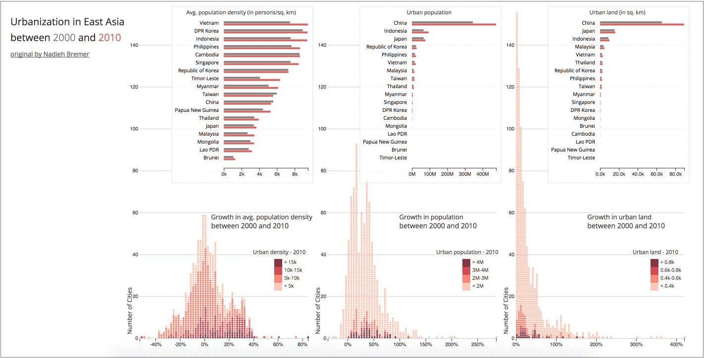

# Programming Assignment 4: Brushing and Linking

### Instructions

In this assignment you will create a version of the charts from [Nadieh Bremer's Urbanization in East Asia narrative visualization](http://nbremer.github.io/urbanization/). We highly recommend going through this visualization as a great example of storytelling and to learn more about the dataset.

In this assignment you will create multiple coordinated charts. You will create 6 total subplots. Your submission should include a bar chart and a dot histogram for each of the following urbanization measures:
* urban land (in sq. km)
* urban population
* urban population density (in persons/sq. km)

The bar charts should compare the 2000 and 2010 metrics for each country. While the histograms should show the distribution of the percent growth for each city (Note: percent growth is already calculated for all three metrics). Your final chart will look like this:

Your subplots will also need to support coordinated interactions for brushing and linking. First, your dot histogram charts will have brushing in the x-direction. The brush will highlight the selected cities from that histogram in the other 2 histograms. Note that only one brush can be active at a time, so you will have to save the state of the active brush. The interaction should look like this:

Next, your submission should include linking from the bar charts to the histogram plots. Since the bar charts display all of the East Asian countries, you will use `mouseover` and `mouseout` events (aka hovering) to trigger a linked highlighting in all other views. The dots in the histogram should be highlighted if they are the same country, and the grouped bars of that country in the other 2 bar charts should be highlighted as well. The interaction should look like this:

You will use the dataset at `./data/asia_urbanization.csv` to re-create the Urbanization in East Asia interactive visualization. **Use the above relative path when calling `d3.csv()`. We will deduct 2 points if you do not use a proper relative path.**

Here is a snippet of the dataset:

**city**|**country**|**latitude**|**longitude**|**land\_2000**|**land\_2010**|**land\_growth**|**pop\_2000**|**pop\_2010**|**pop\_growth**|**density\_2000**|**density\_2010**|**density\_growth**|**type\_country**
:-----:|:-----:|:-----:|:-----:|:-----:|:-----:|:-----:|:-----:|:-----:|:-----:|:-----:|:-----:|:-----:|:-----:
Tokyo|Japan|35.7090259|139.7319925|5434|5570|0.025|27695526|31788261|0.148|5097|5707|0.12|high-income
Jakarta|Indonesia|-6.2087634|106.845599|1338|1600|0.196|16291976|23431674|0.438|12174|14643|0.203|lower-middle-income
Beijing|China|39.904211|116.407395|1827|2716|0.487|10754014|16707094|0.554|5887|6151|0.045|upper-middle-income
Seoul|Republic of Korea|37.566535|126.9779692|1067|1192|0.117|14277211|15898238|0.114|13378|13342|-0.003|high-income
Bangkok|Thailand|13.7563309|100.5017651|1910|2126|0.113|7825880|9555372|0.221|4098|4495|0.097|upper-middle-income

* `city` (`string`) - the name of the urban city
* `country` (`string`) - the name of the country
* `land_2000` (`number`) - the recorded land in 2000 (sq. km)
* `land_2010` (`number`) - the recorded land in 2010 (sq. km)
* `land_growth` (`number`) - the percent growth in land between 2000 and 2010
* `pop_2000` (`number`) - the recorded population in 2000
* `pop_2010` (`number`) - the recorded population in 2010
* `pop_growth` (`number`) - the percent growth in population between 2000 and 2010
* `density_2000` (`number`) - the recorded population density in 2000 (persons per sq. km)
* `density_2010` (`number`) - the recorded population in 2010 (persons per sq. km)
* `density_growth` (`number`) - the percent growth in population density between 2000 and 2010

You will use this dataset to create the above multiple coordinated plots.

### Data-Bindings

The data-bindings on the grouped bar charts are:
* grouped bars - 1 bar for 2000 and 2010 for each country
* width - [sum of `land` & `population` | mean of `density`] in a `scaleLinear`
* fill color - different color for 2000 and 2010
* sorted by 2010 value

The data-bindings on the dot histograms are:
* dots - 1 dot per city
* x-position - binned by `growth` measure - recommend using `d3.histogram` to calculate intermediate layout dataset (hint: use `xScale.ticks(80)` to compute the histogram's `thresholds()` like they do in [this example](https://bl.ocks.org/mbostock/3048450))
* fill color - discrete colors based on 2010 value using `scaleQuantize`
* sorted by 2010 value in y-direction

You will need to re-configure the dataset two different ways:

1. For the grouped bar charts, you will want to use `d3.nest()` to compute an aggregated dataset for each country. You will compute the `sum` for `land` and `population`, and the `mean` for `density`.
2. For the dot histogram you will need to use d3.histogram to compute a binned dataset based on each measure: `land_growth`, `pop_growth`, `density_growth`. As mentioned above to get good binning use `xScale.ticks(80)` to compute the histogram's `thresholds()` like they do in [this example](https://bl.ocks.org/mbostock/3048450). Where `xScale` is a `scaleLinear` function that maps the input domain of the `growth` measure to the width of the histogram.

You will create this interactive chart using D3's Brush tool. We will cover how to create brushing in Lab 8, so stay tuned. In the mean time, take a look at these examples for how to add brushing:

* [Bostock's Brush Bl.ock](https://bl.ocks.org/mbostock/34f08d5e11952a80609169b7917d4172)
* [Brush in Scatterplot Matrix. v3, but still relevant](https://bl.ocks.org/mbostock/4063663)

> Reminder that this is an individual assignment. The code you turn in should be your own creation. You are certainly welcome to seek assistance from the TAs as you work on the assignment, however.

### Starter code

All of the starter code for the Programming Assignments can be found at the [HW Github Repository](https://github.gatech.edu/CS4460-Spring2018/Homework). `git clone` this repository for this assignments starter code. You will need to `git pull` for all future starter code.

**You are required to use the starter code for all programming assignments.**

### What to turn in

You will submit your code via T-Square. Compress your code (the `04_brush_and_link` directory) into a zip file. Upload and submit this zip file via T-Square.

### Deadline

Your zipped code should be submitted to T-Square by **11:55 PM on Thursday, April 19th.**

### Grading

This assignment will be graded out of a 100 point scale. If your D3 code does all of the following you will receive all 100 points:

1. Creates 6 total subplots. 1 grouped bar chart, and 1 dot histogram for each of the 3 urbanization measures. All charts follow the data-bindings in the above "Data-Bindings " section.
2. The dot histogram subplots support x-direction brushing between plots. Only one brush can be active at a time.
3. The grouped bar charts support "on-hover" linking to all other charts. When hovering over a group of 2 bars, the same country will be highlighted on the other 2 bar charts and all cities from that country will be highlighted on the dot histograms.
4. The entire visualization is contained within one SVG element.
5. You are required to add a title, labels, legends, and axes to all charts.

You will not **lose points** on any of the following:

1. The styling of the chart, grids, axes, legends or labels
2. The number of ticks in the axes
3. The number of bins used in the histogram, but all dots should still be legible
4. The number of bins used in the color scales
5. Conventions or legibility of your code
6. Handling any other datasets than `./data/asia_urbanization.csv`
# d4brushlink
# d4brushlink
